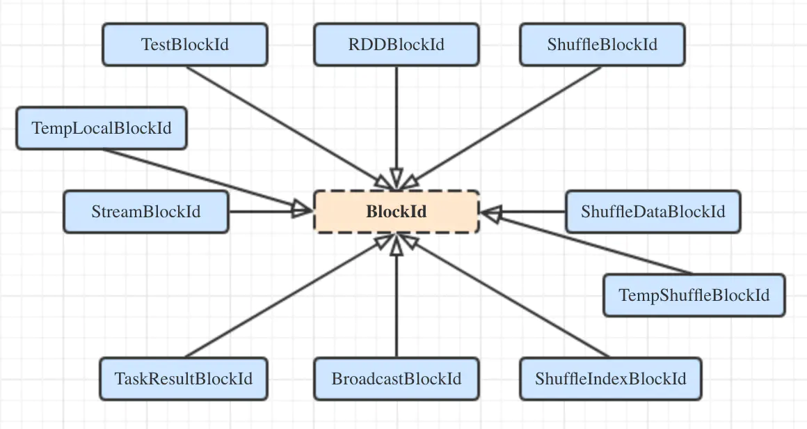

### Block

Block(块)是Spark存储的基本单位，其有一个块ID来标识其身份，也就是BlockId，它唯一的标识了特定的数据块，并一般都与单独的一个文件关联。一个块能够通过它的文件名
唯一的标识，但是块的每一种类型都有不同的key的集合来产生它的独特的名称。如果BlockId需要被序列化，需要确保添加序列化逻辑到BlockId.apply()方法中。

BlockId是一个抽象类，name()方法返回此BlockId的唯一名称，isRDD()、isShuffle()、isBroadcast()三个方法的返回值类型都是布尔值，分别用于判断该BlockId是否为
RDD的BlockId、Shuffle的BlockId和Broadcast的BlockId。我们点开BlockId的实现会发现，这三个类型(当然还有其余七种类型)的BlockId都是BlockId的子类，其实每一
种类型的BlockId的实现都是无比的简单的样例类，只是覆盖实现了name()方法，使其的命名符合一定的规则，在其最后的伴生对象种，有所有命名的正则表示。其继承体系如下图
所示：

Block既然用于表示具体的数据，那么在分析了其Id的生成后，再来看一下具体的数据的封装逻辑吧。BlockData类，一个抽象了块的存储方式及提供了不同的方式读取其底层块数据
的特征，其定义的方法都是虚方法，简要的对每个方法都看一下吧：
  * toInputStream()：将块数据转化为java.io.InputStream输入流;
  * toNetty()：返回一个块数据的对Netty友好的包装，方便在Netty上进行传输;
  * toChunkedByteBuffer()：将块数据转化为ChunkedByteBuffer(ChunkedByteBuffer是对多个java.nio.ByteBuffer的封装，表示的是多个不连续的内存缓冲区中的数据);
  * toByteBuffer()：将块数据转化为单个java.nio.ByteBuffer;
  * size()：返回这个BlockData的长度;
  * dispose()：销毁BlockData，当用户已经完成了对块的操作的时候，dispose()方法需要被调用;

由上面的介绍可以知道，BlockData只定义了数据读取和转化的规范，而并不涉及具体的存储和读写。点开BlockData的实现会发现，其有三个实现类：ByteBufferBlockData、
DiskBlockData，以及EncryptedBlockData。

我们来看看最简单也是与BlockData在一个文件中的ByteBufferBlockData类的实现，真的是太简单了，就是直接代理了ChunkedByteBuffer的各种方法。那好吧，直接看ChunkedByteBuffer
的实现逻辑吧。ChunkedByteBuffer是一个只读的ByteBuffer的数组，在物理上存储为多个chunks而不是单个连续的数组，类的构造方法参数是一个名为chunks的Array[ByteBuffer]类型
的对象，Array中的每个Buffer的也就是一个ByteBuffer就是一个Chunk。它提供了一个writeFully()方法，用来将缓存块数据以bufferWriteChunkSize的大小写入NIO Channel。该类的
成员属性如下：
  * bufferWriteChunkSize：Chunk的大小，以字节为单位，由spark.buffer.write.chunkSize配置项来确定，默认值64MB;
  * disposed：是否已被销毁，默认是否;
  * size：ChunkedByteBuffer的大小，以字节为单位，通过调用ByteBuffer.limit()方法获取每个Chunk的大小并累加得到;

Block数据存储在BlockData中，但是它仅仅是数据，如果我们想要使用还需要这些数据的元数据信息(与HDFS类似，DataNode只存储数据，如果需要使用还需要NameNode提供的元数据信息，才能
得到真正的能使用的文件)。在Spark中也是一样，为了方便跟踪块的一些基本数据，需要用一个专门的数据结构BlockInfo来维护。BlockInfo类有三个构造方法参数：
  * level：块的期望存储等级，也就是StorageLevel，但是并不代表实际的存储情况(有可能设置level为StorageLevel.MEMORY_AND_DISK，但是块只存储在内存中而不在磁盘)；
  * classTag：块的类标签，用于选择序列化器;
  * tellMaster：是否需要将该块状态的改变通知Master，在大多数情况下需要通知，但是如果是Broadcast块就不需要通知;

除了上面介绍的三个构造方法参数，BlockInfo还定义了3对Getter/Setter：
  * size：块的大小，以字节为单位;
  * readerCount：该块被加锁以进行读取的次数;
  * writerTask：当前持有该块写锁的Task ID，如果写锁被非Task的代码持有则为BlockInfo.NON_TASK_WRITER，如果写锁没有被持有则过BlockInfo.NO_WRITER(需要注意的是，锁并非
  BlockInfo提供的，而是由BlockInfoManager提供)。

