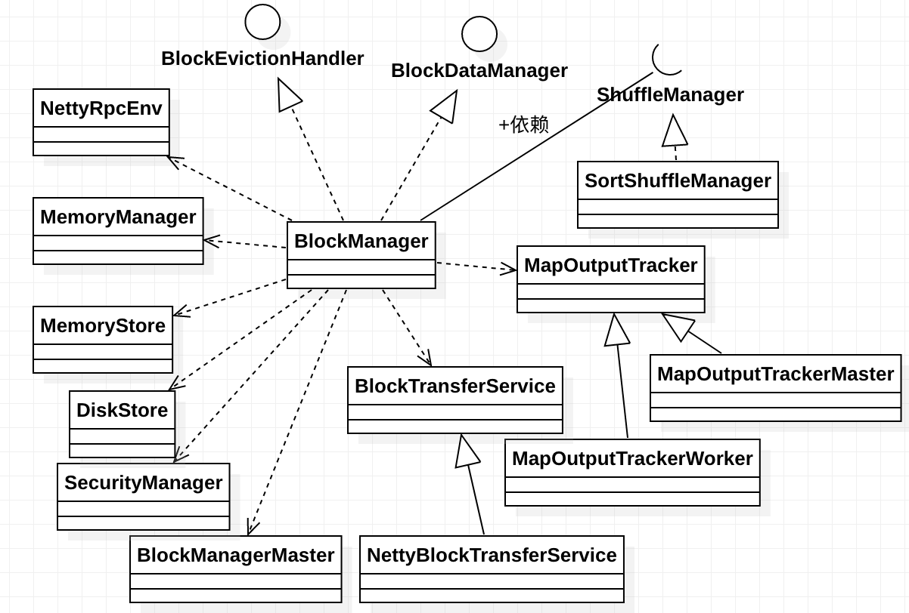

### BlockManager

BlockManager块管理器，负责管理块的块既能存在于内存，也可以存在于磁盘，它通过前面分析过的MemoryManager、MemoryStore管理内存中的数据块，通过前面分析过的
DiskBlockManager、DiskStore管理磁盘中的数据块，通过BlockManagerMaster来实现各个节点中的BlockManager的协调，1700多行的类代码也显示了其复杂性^-^。其
类图如下所示：

BlockManager的构造方法参数很多，一共有11个之多，那些在前面已经出现过的类型就不再赘述，有三个类型是以前没有分析过的：用于跟踪Stage的Map输出位置的组件MapOutputTracker、
负责driver端生成shuffle以及executor的数据读写的组件ShuffleManager以及用于在各个节点中进行块传输服务的BlockTransferService。

BlockManager实现了BlockDataManager和BlockEvictionHandler特征类，它们分别用于对块进行管理和在内存中淘汰块。再来看看其成员属性：
  * externalShuffleServiceEnabled：表示是否启用外部Shuffle服务，由spark.shuffle.service.enabled配置项控制，默认是不启用。外部Shuffle服务是对Spark的
  一个性能调优，它是长期存在于NodeManager进程中的一个辅助服务，通过该服务来抓取shuffle数据，减少了Executor的压力，在Executor GC的时候也不会影响其他Executor
  的任务运行;

  * remoteReadNioBufferConversion：表示是否支持转化为远程读取NIO Buffer，由spark.network.remoteReadNioBufferConversion配置项控制，默认是false;

  * futureExecutionContext：用于异步执行BlockManager中的某些操作的守护线程池，大小是128;

  * shuffleServerId：用于保存Shuffle文件的服务的BlockManagerId，如果启用外部服务就新建一个BlockManagerId的实例，否则就是本地executor的BlockManager;

  * shuffleClient：用于读取其它executor的Shuffle文件的客户端，如果启用外部服务就新建一个ExternalShuffleClient的实例，否则就是传入的blockTransferService
  参数;

  * slaveEndpoint：BlockManager的从RPC端点的引用，通过rpcEnv.setupEndpoint()创建;

  * blockReplicationPolicy：Spark中的块复制策略;

再来分析其中的方法，先看initialize()方法，这个方法会在SparkContext和Executor的初始化中被调用，其主要逻辑如下：
  * 首先，初始化blockTransferService和shuffleClient;

  * 根据spark.storage.replication.policy配置项确定块的复制策略并通过反射创建该策略的实例，默认策略是RandomBlockReplicationPolicy;

  * 根据executorId、blockTransferService的主机名和端口创建BlockManagerId的实例id，并调用master.registerBlockManager()方法在Driver上注册id，如果注册成功
  会返回一个注册成功后的idFromMaster;

  * 如果注册成功返回的idFromMaster不是null就用其作为此blockManager的blockManagerId，否则就用先前创建的id;

  * 生成Shuffle服务的id;

  * 如果当前节点启用了外部服务且不是Driver节点，就调用registerWithExternalShuffleServer()方法来注册外部Shuffle服务;

在BlockManager中提供了多种方法来对块数据进行读写，我们先来分析其中的一个能同时进行读写的方法getOrElseUpdate()方法，在RDD类中有对该方法的调用，它能取回给定的块
如果块存在的话，否则将调用提供的makeIterator()方法来计算块，持久化它并返回其数据。其执行逻辑是：先尝试从本地和远程存储中读取块数据，如果块存在，那么我们将不需要
执行本地的读取或写入的逻辑，否则就调用传入的makeIterator()函数将数据转化为迭代器并写入，最终将写入结果封装在BlockResult中返回。

在上面的方法中调用了get()方法来尝试从本地或远程存储中读取数据，其具体逻辑是：先调用getLocalValues()方法从本地executor读取数据，如果读取不成功，那就调用getRemoteValues()
从远程存储读取数据。

上面调用到的getLocalValues()方法根据blockId从本地读取块数据，其具体逻辑是：
  * 首先blockInfoManager.lockForReading()方法对数据块进行加锁，这个方法在前面已经分析过，它试图对块数据加读锁，如果块数据存在且加锁成功，则返回对应块的元数据
  BlockInfo;

  * 如果返回为None表示块在本地不存在直接返回None，否则就根据BlockInfo的信息获取块数据的存储级别，按照先内存再磁盘的方式依次进行读取;

  * 如果该块的存储级别使用到了内存，且memoryStore中包含块id，这表示块数据存储在内存中，那么就判断是否需要反序列化，如果不需要就直接调用memoryStore.getValues()方法
  读取数据，否则就调用memoryStore.getBytes()读取数据并调用serializerManager.dataDeserializeStream()对读取到的数据进行反序列化;

  * 如果该块的存储级别使用到了磁盘，且diskStore中包含块id，这表示数据存储在磁盘中，那么就先通过diskStore.getBytes()读取磁盘中的块数据，然后根据是否需要反序列化来进行
  不同的处理。如果需要反序列化，就调用diskData.toInputStream()获取输入流并调用serializerManager.dataDeserializeStream()方法对流进行反序列化，成功后还会尝试对数据
  在内存中缓存一份，否则先调用maybeCacheDiskBytesInMemory()方法将磁盘的数据缓存到内存中，缓存成功会导致原来从磁盘读取的数据不可用;

  * 调用releaseLock()或releaseLockAndDispose()方法以释放所加的读锁

  * 最终返回的是BlockResult，数据在其中以迭代器的形式表示，此外该类中还封装有读取方法和块数据的字节数。如果从内存和磁盘读取都不成功，就调用handleLocalReadFailure()方法
  处理本地读取错误;

上面调用到的getRemoteValues()方法根据blockId从远程存储读取块数据，getRemoteValues()方法很简单，因为其将大部分的工作都交给getRemoteBytes()方法。getRemoteBytes()方法
从远端BlockManager中获取块数据，结果是序列化的字节流形式。其具体执行逻辑如下：
  * 如果BlockId不为空，则调用master.getLocationsAndStatus()方法，获取所有持有该块数据的远程BlockManager位置和状态信息(由于所有的远程块都已经在driver中注册，所以并不
  需要向所有的executor获取块的状态信息)，并从中解析出块的大小和位置;

  * 如果块大小大于spark.maxRemoteBlockSizeFetchToMem配置的大小(默认是Int.MaxValue - 512)，则我们应该将remoteBlockTempFileManager传递给BlockTransferService，这
  将导致它溢写到块，传递null表示块将会被持久化到内存;

  * 调用sortLocations()方法，它将会根据BlockManagerId中的拓扑信息对BlockManager的位置进行排序，本地机器上的BlockManager排在最前(不同的BlockManager可以共享同一个机器)，
  然后是同一机架上的非本地机器上的BlockManager，最后是不同机架的机器上的BlockManager;

  * 对于获取到的排好序后的每一个远程BlockManager，调用BlockTransferService.fetchBlockSync()方法同步地获取块数据，如果获取到的数据为null则返回空，否则如果支持转化为远程
  读取NIO Buffer则通过nioByteBuffer()方法读取并以ChunkedByteBuffer的形式返回，否则调用ChunkedByteBuffer.fromManagedBuffer()读取数据并以ChunkedByteBuffer的形式返回;

  * 如果从某个远端BlockManager获取不到块数据，就继续尝试下一个，当总的失败尝试的次数大于设置的最大尝试次数时，就认为此次读取失败返回None。当失败的尝试次数达到spark.block.failures.beforeLocationRefresh
  配置项设定的阈值时(默认值是5)，就主动刷新一次远端BlockManager的位置，以防过期;

  * 如果已经尝试了所有的远端BlockManager依然没有获取到数据，就认为此次读取失败，返回None;