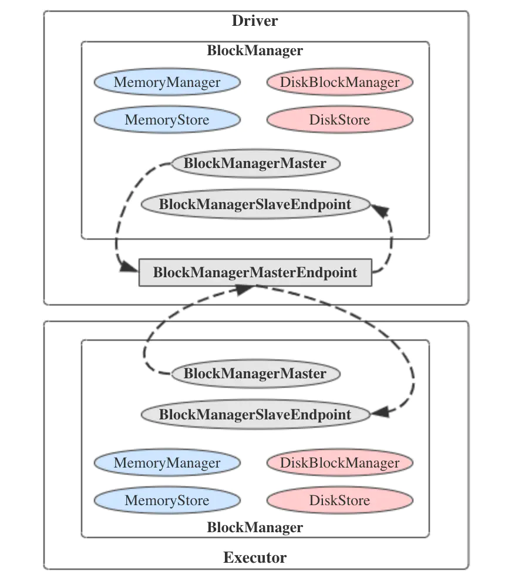

### BlockManagerMaster

在[Spark源码阅读6：RpcEnv](./rpcenv.md)里面已经提到过SparkEnv中创建的诸多组件之一的BlockManager块管理器，它负责管理块的存储、读写和状态信息，是整个
Spark存储子系统的基础。既然它是Spark存储子系统的基础，当然得来拜读一下其源码，了解一下它与前面介绍的MemoryManager及DiskBlockManager之间的关系。

BlockManager也是主从架构，它运行在所有的节点，包括Driver节点和Executor节点，并且提供了本地和远程接口来写入和定位位于不同存储中的块，其初始化依赖于多个
组件，大部分都介绍过了，但是有一个组件BlockManagerMaster还没有分析过，先来看看BlockManagerMaster的源码。

BlockManagerMaster是对BlockManager进行管理的组件，用于对运行于各个节点的BlockManager进行协调。上面已经提到，BlockManagerMaster在SparkEnv中创建，
其初始化时接受一个RpcEndpointRef实例作为参数，这个实例是通过registerOrLookupEndpoint()方法注册的，类型是BlockManagerMasterEndpoint，在注册时会
判断当前节点的类型，如果是Driver节点就调用rpcEnv.setupEndpoint()注册到RpcEnv中，否则就调用RpcUtils.makeDriverRef()方法(内部是调用rpcEnv.setupEndpointReff()
方法)根据名称得到对Driver中BlockManagerMasterEndpoint的引用。

BlockManagerMasterEndpoint是一个在master上的线程安全的RpcEndpoint，用于追踪所有slave上的BlockManager的状态，其构造函数有四个，分别是：RpcEnv、isLocal标识、
SparkConf、LiveListenerBus。下面来看看其成员属性：
  * blockManagerInfo：存放着BlockManagerId及BlockManagerInfo的映射关系。BlockManagerId是一个BlockManager唯一的标识符，里面封装着BlockManager
  的executorId、主机地址、端口、拓扑信息、是否Driver标识等各种信息，而BlockManagerInfo类是一个私有类，与BlockManagerMasterEndpoint定义在同一个文件
  中，里面存放着BlockManager的基本信息;

  * blockManagerIdByExecutor：存放着ExecutorId及BlockManagerId的映射关系;

  * blockLocations：存放着BlockId与拥有块的BlockManagerId集合的映射关系;

  * askThreadPool/askExecutionContext：BlockManager请求线程池及请求执行的上下文;

  * topologyMapper：通过反射创建的topologyMapper类的实例，实例对象由spark.storage.replication.topologyMapper配置项指定，默认是DefaultTopologyMapper，
  用于获取拓扑信息;

再来看其方法，首先是receiveAndReply()方法，通过覆盖RpcEndpoint.receiveAndReply()方法实现，实现上很长，但是逻辑还是比较简单，主要是根据消息的类型
进行不同的处理，所有的消息类型在BlockManagerMessages中都有定义。

直接抽选几种消息的处理方法来看下吧，先看第一个RegisterBlockManager消息。
RegisterBlockManager消息的处理对应的方法是register()方法，如果成功它会返回放入了拓扑信息的BlockManagerId，具体逻辑是：由于传入的BlockManagerId
没有拓扑信息，所以首先根据传入的BlockManagerId构造出一个新的BlockManagerId的实例，如果在blockManagerInfo里面没有新构造出的BlockManagerId，但是
blockManagerIdByExecutor里面却有其对应的ExecutorId，这表明该executor很可能已经死掉了，所以就调用removeExecutor()将其移除掉。然后更新blockManagerIdByExecutor
和blockManagerInfo映射，随后向事件总线发送SparkListenerBlockManagerAdded消息，标志着BlockManager注册成功，将新的BlockManagerId返回。

BlockManagerHeartbeat消息的处理对应的方法是heartbeatReceived()方法，如果driver知道给定的BlockManager则返回true，否则返回false表示BlockManager
应该被重新注册。实现上是如果blockManagerInfo包含给定的BlockManagerId，就更新blockManagerInfo中最后一次心跳的事件_lastSeenMs。

既然有BlockManagerMasterEndpoint，那么肯定也有与其对应的BlockManagerSlaveEndpoint，它是一个Rpc的端点，用于从master获取指令来执行选项。它同样也
覆盖了receiveAndReply()方法，其中对包含了移除块的操作都是异步执行的因为可能会比较慢，所有的具体实现都是通过调用传入的参数中的BlockManager和MapOutputTracker
的方法来实现。

分析完了BlockManagerMasterEndpoint和BlockManagerSlaveEndpoint，再来看BlockManagerMaster，它的实现其实都非常的简单，所有的方法都是通过driverEndpoint
的ask()/askSync()方法向对应的RPC端点发送各种类型的消息并通过它们调用BlockManager调用相关的方法进行具体的处理。

从上面的分析，我们可以更加明确，BlockManagerMaster其实是通过RPC机制来对各个节点的BlockManager进行管理和通信协调，让它们能够各司其职，共同配合在分布式的
环境下完成BlockManager的各项功能。最后，用一张图来总结BlockManagerMaster的主从架构吧。
