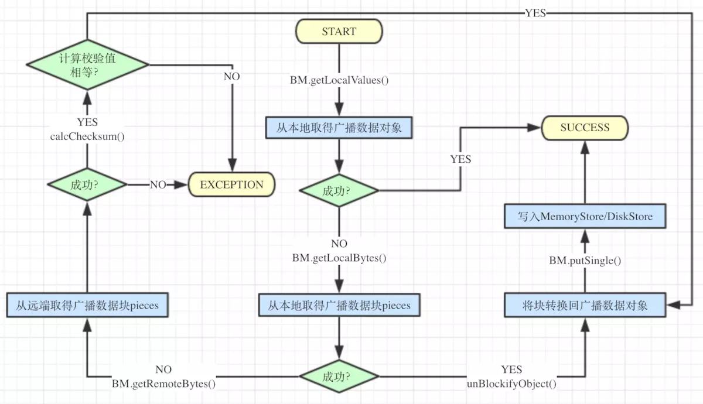

### Broadcast

前面已经说到，广播变量是Spark两种共享变量中的其中一种(另一种是累加器)，适用于处理多个节点跨Stage共享数据(主要是读取)，特别是输入数据量较大的集合，可以
提高效率。

首先分析广播管理器BroadcastManager，它是在SparkEnv中直接初始化的。其主构造函数有三个参数，分别是isDriver(是否为Driver节点)、conf(对应的SparkConf
配置)、securityManager(对应的SecurityManager)。其内有四个属性成员：
  * initialized：表示BroadcastManager是否已经初始化完成；

  * broadcastFactory：广播工厂的实例(BroadcastFactory特征的实现)；

  * nextBroadcastId：是下一个广播变量的唯一标识(AtomicLong类型)；

  * cachedValues：用于缓存已广播的变量，属于ReferenceMap类型，是apache-commons提供的一个弱引用映射的数据结构，与常见的Map不同，其键值对可能会在GC
  过程中被回收。

再来分析一下其中的方法：
  * initialize()：首先通过initialized判断BroadcastManager是否已经初始化，如果没有则新建广播工厂TorrentBroadcastFactory，并将其初始化，然后将
  initialized置为true。

  * newBroadcast()：用于创建一个新的广播变量，它直接调用了TorrentBroadcastFactory中的同名方法创建了一个TorrentBroadcast对象实例。

  * unbroadcast()：将已存在的广播变量取消广播，它与newBroadcast()一样，也是简单的调用了TorrentBroadcastFactory中的同名方法。

现在再来看一下广播变量的具体实现类TorrentBroadcast，先分析一下它的主要属性：
  * _value：广播块的具体数据，lazy关键字定义表示它是懒加载的，在TorrentBroadcast构造时并不会调用readBroadcastBlock()方法获得数据，而是会推迟到
  第一次访问_value的值时。

  * compressionCodec：广播块的压缩编解码逻辑，如果为None表示禁用，当配置项spark.broadcast.compress为true时会启用压缩。

  * blockSize：广播块的大小，由spark.broadcast.blockSize配置项控制，默认值为4MB。

  * broadcastId：广播变量的ID，由BroadcastBlockId根据id生成，而BroadcastBlockId是一个非常简单的样例类，每当产生一个新的广播变量就会自增。

  * numBlocks：该广播变量包含的块数量，与_value不一样的是它没有lazy关键字限定，所以在TorrentBroadcast构造时就会直接调用writeBlocks()方法。

  * checksumEnabled：是否对广播块计算校验值，由spark.broadcast.checksum配置项控制，默认为true。

  * checksums：广播块的校验值。

TorrentBroadcast在构造时会直接调用writeBlocks()方法写入广播变量，来深入的看一下这个方法：
  1. 获取BlockManager实例，调用其putSingle()方法将广播数据作为单个对象写入本地存储，需要注意的是StorageLevel为MEMORY_AND_DISK，也就是在内存
  不足时会写到硬盘，且服本书为1，表示不会进行复制。

  2. 调用blockifyObject()方法将广播数据转化为块，即Spark存储的基本单元，使用的序列化器为SparkEnv中初始化的JavaSerializer。

  3. 如果需要对广播块计算校验值，就用calcChecksum()方法计算每个块的校验值。

  4. 为广播数据切分称的块(piece)生成一个带"piece"的广播ID，调用BlockManager.putBytes()方法将各个块写入，StorageLevel为MEMORY_AND_DISK_SER，表
  示写入的数据会序列化后写到内存或硬盘中。

  5. 返回块数量。

广播变量的读取调用的是readBroadcastBlock()方法，其执行逻辑如下：
  1. 同样是获取BlockManager实例，然后调用getLocalValues()方法将之前写入的广播数据对象取出。

  2. 如果能够直接取出广播数据，就调用releaseLock()方法(实际上还是调用的是BlockManager.releaseLock()，最终对应Object.notifyAll()方法)，释放当前块
  的锁，这个锁是用于保证块读写的互斥。

  3. 如果无法直接获取广播数据，说明数据已经被序列化，并且很有可能不是存储在本地，可以通过调用readBlocks()方法从本地和远端同时获取块，然后调用unBlockifyObject()
  方法将块转换回广播数据对象。

  4. 再次调用BlockManager.putSingle()方法将广播数据作为单个对象写入本地存储，并将其加入到广播缓存Map中，下次就能直接获取了。

再来看下readBlocks()方法的实现：
  1. 对所有广播的piece打散，并对打散后的每个piece执行下面的步骤。

  2. 调用BlockManager.getLocalBytes()方法，从本地获取序列化后的广播数据块，并将获取到的块放入到对应下表的位置，然后释放该块的锁。

  3. 如果本地没有广播数据，就需要调用BlockManager.getRemoteBytes()方法从远端(Driver或其它Executor)获取广播数据块。

  4. 对从远端获取的数据块计算校验值，并与之前写入时计算的校验值进行比对，如果不相等说明传输中发生了错误，直接抛出异常。

  5. 如果校验值相等，就调用BlockManager.putBytes()方法，将各个块写入到内存或硬盘中，并将其放入到对应下标的位置。

  6. 返回所有读取到的数据块。

最后，用一张图来描述广播变量读取的流程：

