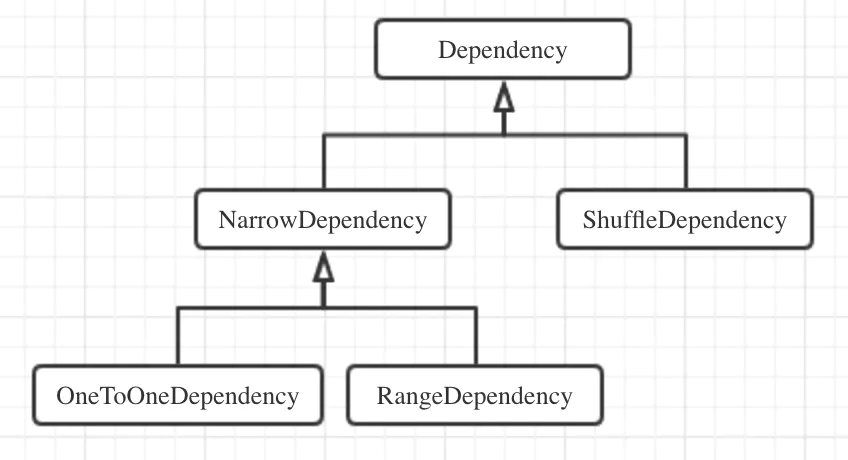

### RDDDependency

在Spark Core中，RDD依赖关系的基类是Dependency抽象类，该类中只定义了一个方法rdd()，用于取得当前RDD依赖的父RDD，其继承体系如下图所示：

RDD的依赖关系可以分为两种：
(1) 窄依赖：父RDD的每个分区最多被其子RDD的一个分区所依赖，也就是说子RDD的一个分区固定对应一个父RDD的单个分区，子RDD每个分区的生成与父RDD的数据规模
无关，窄依赖在代码中的基类是NarrowDependency抽象类。

NarrowDependency类带有一个构造方法参数_rdd，并重写rdd()方法让其返回，它就是当前RDD依赖的父RDD。此外，NarrowDependency类还定义了一个抽象方法
getParents()，用于返回partitionId对应分区依赖的所有父RDD的分区ID。该方法由NarrowDependency的子类实现，分别是OneToOneDependency(一对一依赖)
和RangeDependency(范围依赖)，它们返回的都是只有一个元素的List。OneToOneDependency的父子RDD分区ID严格相同，常见的map()或filter()等算子都会
产生OneToOneDependency。而在RangeDependency中，子RDD中ID为partitionId的分区与父RDD中ID为(partitionId - outStart + inStart)的分区一一
对应，其中inStart为父RDD分区ID的起始值，outStart为子RDD分区ID的起始值，例如union()算子就会产生这种依赖。

OneToOneDependency和RangeDependency都是一一对应关系，当子RDD分区对应多个父RDD的分区(如join()算子)时，也可以形成窄依赖，其前提是父子RDD的分区
规则完全相同，即子RDD的某个分区对应父RDD 1的分区p，也对应父RDD 2的分区p，如果分区规则不同，就会变成宽依赖。

窄依赖图//todo,假装此处有图,真的以后补

(2) 宽依赖：实际上没有WidthDependency这样个类，实际上的类名是ShuffleDependency，叫做"Shuffle依赖"，父RDD的每个分区被其子RDD的多个分区所依赖，且
往往是全部分区，子RDD的每个分区的生产与父RDD的数据规模相关。

ShuffleDependency类有三个泛型参数，K代表键类型，V代表值类型，C代表Combiner的类型。由于Shuffle过程对键值型数据才有意义，所以ShuffleDependency对
父RDD的泛型类型有限制，必须是Product2[K,V]或其子类，Product2在Scala中代表两个元素的笛卡尔积。

ShuffleDependency类的其它构造方法参数如下：
  * partitioner：分区器;

  * serializer：闭包序列化器，SparkEnv中已创建，实际为JavaSerializer;

  * keyOrdering：可选，对键类型K排序的排序规则;

  * aggregator：可选，Map端数据聚合逻辑;

  * mapSideCombine：指定是否启用Map数据预聚合;

随着宽依赖的创建，还会调用SparkContext.newShuffleId()方法分配一个新的Shuffle ID，以及调用ShuffleManager.registerShuffle方法注册该Shuffle，返回
Shuffle句柄(ShuffleHandle)。

宽依赖图//todo,假装此处应有图,真的以后补

区分宽依赖与窄依赖的原因是：窄依赖关系的RDD在集群的节点的内存中可以以流水线(pipeline)的方式高效运行。

在Shuffle过程中，必须得有确定的计算逻辑来决定父RDD的分区数据如何分配并对应到子RDD的分区中，这就是分区器Partitioner的职责。numPartitions()方法返回分区
总数，而getPartitions()方法根据键返回其对应的分区ID。Partitioner还带有一个伴生对象，其中定义了defaultPartitioner()方法，它根据上游的一个或一些RDD返
回默认的分区逻辑，该方法会从输入的所有RDD中取出那些定义了分区逻辑的RDD，然后找到其中分区数最大的那个Partitioner。如果SparkConf中定义了缺省并行度配置项，即
spark.default.parallelism配置项，那么默认分区器的分区数就会采用该参数的值，否则就直接用所有RDD中最大的分区数，所以在提交Spark作业时一般都推荐设置该值。
然后，调用isEligiblePartitioner()方法，判断分区数最大的那个Partitioner是否"合格"，判断逻辑是其分区数与所有上游RDD中最大分区数之差小于一个数量级。如果通过
检查，并且默认分区数比它小，就采用分区数最大的那个Partitioner作为分区逻辑，否则用默认分区数构造一个新的HashPartitioner并返回。

Partitioner在Spark Core中的实现类主要有两个：基于散列的HashPartitioner和基于采样范围的RangePartitioner，前者是默认实现。可见，在重写getPartition()方法
中，会取得键的hashCode值，然后按分区数numPartitions取模，返回其绝对值，这样就确保映射到的分区落在[0, numPartitions-1]的区间内。为了判断两个HashPartitioner
是否相等，也必须同时重写其equals()和hashCode()方法，判断标准是其分区数。当然，我们也可以通过自己继承Partitioner类自定义分区逻辑，如通过Key的长度来分区。