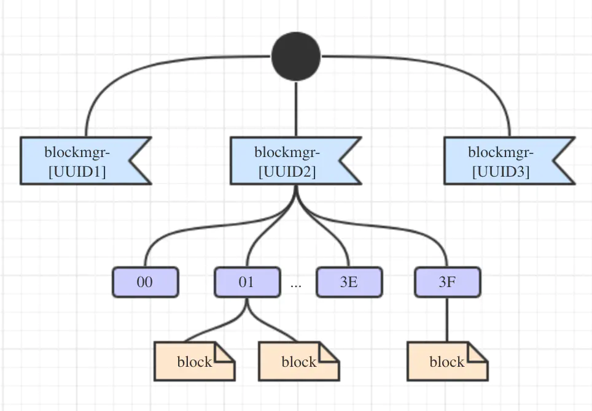

### DiskBlockManager

分析完了内存存储相关的源码，再来看看磁盘存储相关的吧！

DiskBlockManager负责创建和维护逻辑块数据及其在磁盘上的存储位置之间的逻辑对应关系，一个块数据被映射为一个拥有名字的文件，名字由BlockId生成。
其构造函数接受两个参数：SparkConf的实例conf和布尔类型的deleteFilesOnStop，后者表示的是在停止DiskBlockManager时是否需要删除本地的存储目
录，在初始化DiskBlockManager时会指定该值。再来看看其成员属性：
  * subDirsPerLocalDir：由spark.diskStore.subDirectories配置项指定，默认是64，表示的是存储目录下的最大子目录数;

  * localDirs：本地存储目录的数组，调用createLocalDirs()方法创建得到，在spark.local.dir配置项中提到的每一个路径都会创建一个本地文件夹;

  * subDirs：二维数组，第一维存放的是本地存储目录，第二维存放的是对应的第一维本地存储目录的所有子目录;

  * shutdownHook：关闭时的钩子Hook，通过调用addShutdownHook()方法来绑定;

先来看一下上面出现过的createLocalDirs()方法，它创建本地目录数组用于存放块数据，具体逻辑是：首先通过调用Utils.getConfiguredLocalDirs()
方法获得所有通过spark.local.dir配置项配置的根目录，然后对于每一个根目录都调用Utils.createDirectory()方法创建目录，然后将目录都放进localDirs
中。getConfiguredLocalDirs()方法的逻辑如下：首先如果是YARN模式下，则获取LOCAL_DIRS环境变量中的配置的目录返回；否则如果配置了SPARK_EXECUTOR_DIRS
环境变量，则获取SPARK_EXECUTOR_DIRS环境变量中配置的目录返回；否则如果配置了SPARK_LOCAL_DIRS环境变量，则获取SPARK_LOCAL_DIRS环境变量中配置的
目录返回；否则如果配置了MESOS_SANDBOX环境变量，且spark.shuffle.service.enabled配置为false(默认为false)，则获取MESOS_SANDBOX环境变量中配置
的目录返回；否则，获取spark.local.dir配置项中配置的目录返回，如果该配置项为空则获取java.io.tmpdir系统属性返回。然后，createLocalDirs()方法
就会创建形如blockmgr-UUID.randomUUID的一级存储目录，如果创建失败其会进行10次的尝试，超过10次会抛出异常。

在addShutdownHook()增加关闭时的钩子后，当关闭时会调用doStop()方法，在doStop()方法中，会判断如果deleteFilesOnStop标记为真，则在DiskBlockManager
关闭之前，会先调用Utils.deleteRecursively()方法递归地删掉本地存储目录。

继续往下到了getFile()方法，这个方法用于通过hash文件的名字来查找某个文件应该存在哪个目录的哪个子目录下，如果子文件夹不存在还会创建，具体的实现
逻辑如下：
  * 调用Utils.nonNegativeHash()方法获取文件名hash的值，该值是一个非负值。这个方法值得注意，它在取绝对值时进行了一个判断，如果得到的hash值不是
  Int.MinValue会调用math.abs()方法获取其绝对值，否则返回0，之所以这么做是因为Int.MinValue通过math.abs()方法获取到的绝对值是自身，这个对Scala
  和Java都是这样，一定要特别注意;

  * 将得到的hash值与localDirs的长度取模，得到本地目录的下标。再将hash值与localDirs的长度相除得到的结果与subDirsPerLocalDir的长度取模，得到
  本地子目录的下标;

  * 检查对应的子目录是否存在，如不存在则根据子目录的下标并格式化为长度为2的十六进制的表示来创建;

  * 返回File对象;

getFile()方法还有一个根据BlockId来获取文件的重载方法，可见blickId.name就是文件本身的名字。

经过以上的一番分析，基本上可以确定DiskBlockManager存储的目录结构如下图所示：

再来看下createTempLocalBlock()和createTempShuffleBlock()这两个方法吧，实现非常的简单，这两个方法分别用来创建存储本地中间结果和Shuffle中间
结果的块ID和文件，它们的块ID分别用TempLocalBlockId和TempShuffleBlockId类来表示。

这个类里面的其它方法的实现也都比较简单，大致扫一下就知道它们都干了啥，就不再记录了。