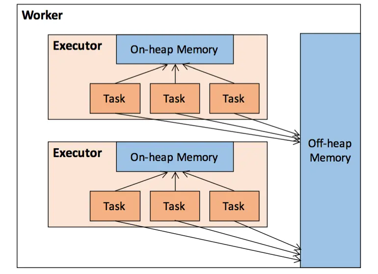

### MemoryManage

Spark与Hadoop MapReduce的区别之一是它会将大量的中间数据存放在内存中，而Hadoop MapReduce中内存仅用于计算，所有的计算结果都需要写磁盘。这不仅使得Spark
能够尤其的适用于迭代计算，也使得Spark在测试中相比于MapReduce能够带来一百倍的性能提升的重要原因之一，今天就对内存管理的源码进行分析。

MemoryPool是一个抽象类，用于对内存的一块可调整大小的区域进行记账管理，在构造它时需要传入一个对象类型的锁lock用于进行多线程同步，它的内部定义了多个方法(返回
值的单位都是字节，且都使用lock进行同步以保证线程安全)：
  * poolSize：获取内存池当前的大小;

  * memoryFree：获取内存池中空闲的内存大小，值就是poolSize-memoryUsed;

  * incrementPoolSize()：扩展内存池delta个字节的大小，final关键字修饰表明该方法不能被覆盖;

  * decrementPoolSize()：缩小内存池delta个字节的大小，final关键字修饰表明该方法也不能被覆盖(已占用的内存不能被缩小掉);

  * memoryUsed：获取内存池中已占用内存的大小，该方法由子类提供具体实现;

点开MemoryPool的实现会发现，其有两个实现类：StorageMemoryPool与ExecutionMemoryPool，StorageMemoryPool主要用于存储(比如存储RDD数据、广播变量数据等)，
ExecutionMemoryPool用于执行(包括Spark的连接、聚合、排序等和Shuffle的过程)。

先来看下StorageMemoryPool类，其构造方法参数除了对象类型的锁lock之外，还有一个是表示这个内存池跟踪的内存模式MemoryMode。MemoryMode是一个枚举类，有两个取值：
ON_HEAP和OFF_HEAP，分别表示堆内存和非堆内存。所谓堆内存就是每个Executor的JVM所使用的那部分内存，而非堆内存是Worker节点上的本机内存，需要通过Unsafe API来分
配，其关系如下图所示：

StorageMemoryPool使用_memoryUsed来记录已使用多少内存，并覆盖了memoryUsed()方法来返回它，此外它还有一个变量_memoryStore来真正的负责块在内存中的存取。下面
来看一看StorageMemoryPool提供的方法：
  * acquireMemory()：为blockId块申请numBytes字节的内存，实际上更多的是判断和执行释放操作。执行逻辑是：首先，检查当前内存池的numBytes-memoryFree是否大于0，
  也就是判断剩余内存是否能满足分配，如果不满足，就调用memoryStore.evictBlocksToFreeSpace()方法，释放出numBytes-memoryFree大小的内存(同步操作)，然后再次
  判断剩余内存量是否能满足分配，如果满足，就增加已使用内存，最终返回分配是否成功。

  * releaseMemory()和releaseAllMemory()：实现非常简单，前者用memoryUsed减去要释放的量，后者直接重置为0;

再来看一下MemoryManager内存管理器吧，它直接管理MemoryPool，强制了执行和存储之间如何共享内存，也是一个抽象类，是Spark作业运行时内存管理的统一入口。Spark环境中
的每个JVM实例都持有一个MemoryManager，构造它时需要传入4个构造方法参数：
  * conf：也就是SparkConf;

  * numCores：分配的CPU核数;

  * onHeapStorageMemory：堆内存储内存的大小，以字节为单位;

  * onHeapExecutionMemory：堆内执行内存的大小，以字节为单位;

紧接着，MemoryManager初始化了4个内存池：堆内存储内存池、堆外存储内存池、堆内执行内存池、堆外执行内存池。堆外内存的最大值由spark.memory.offHeap.size配置项来
指定，默认为0，以字节为单位。堆外存储内存占堆外总内存的比例则由spark.memory.storageFraction配置项指定，默认0.5，也就是堆外存储内存和堆外执行内存各占一半。
通过对4个内存池分别调用其incrementPoolSize()方法来设定合适的容量，即完成了初始化。

在MemoryManager中，三个用于申请内存的方法：acquireStorageMemory()、acquireUnrollMemory()和acquireExecutionMemory()都没有具体实现，需要子类自己去实现。
需要注意的是acquireUnrollMemory()方法中的UnrollMemory的意思，unroll的定义是将partition由不连续的存储空间转换为连续的存储空间的过程，中文上可译为"展开"。
本质上，UnrollMemory和StorageMemory是同一份内存，只是在任务执行的不同阶段的不同逻辑表述形式。在partition数据的读取和存储过程中，这份内存所占用的内存空间是不
连续的，叫做UnrollMemory。而当成功读取存储了所有Record到内存中后，这份内存就以块的形式占用连续的内存空间，就叫StorageMemory(UnrollMemory的概念只存在于spark
的存储模块)。释放内存的方法虽然比较多，但是实现上都很简单，基本上都是代理了MemoryPool对应的释放方法。

MemoryManager类在最后还有一些与Tungsten机制有关的内存管理的属性，Tungsten在提出时是号称Spark有史以来最大的改动，致力于提升Spark程序对内存和CPU的利用率，使性
能达到硬件的极限，堆外内存管理就是其的一部分，它使用类似C语言的方式，直接向OS申请及释放的内存，JVM提通过供sun.misc.Unsafe API来实现。