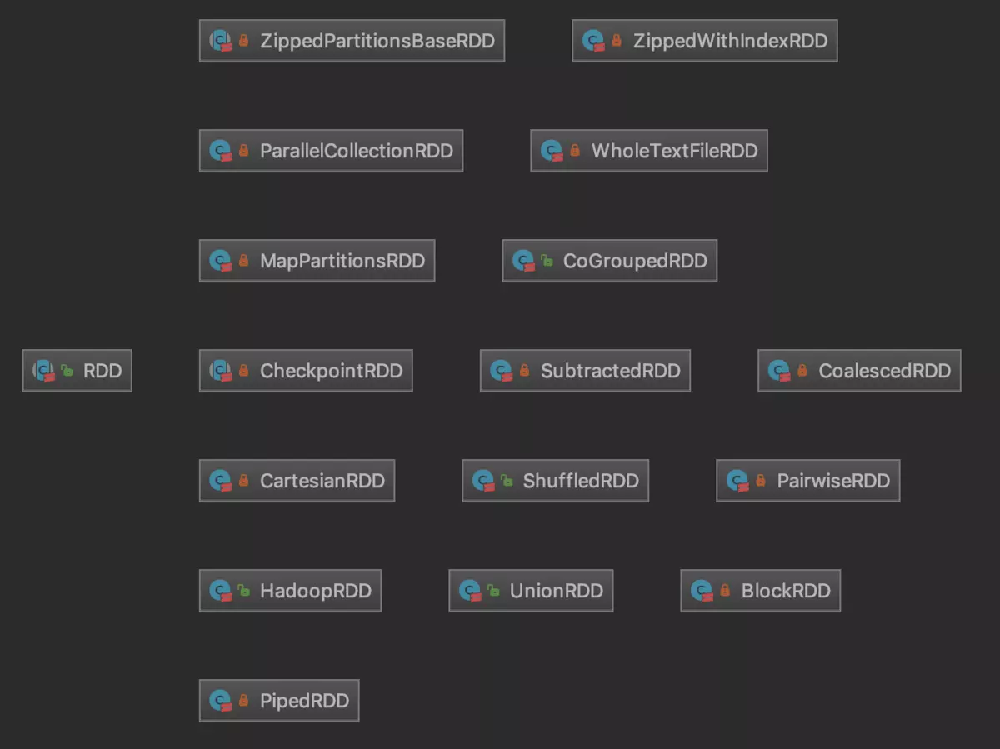

### RDD操作

RDD是弹性分布式数据集(Resilient Distributed DataSet)，是可以并行操作的、容错的元素集合，此外，它还有一些其它相关的特点：
  * 不可变性：只能通过new生成或转换，不能直接修改，出错时可以重算;

  * 分区性：内部数据会划分为Partition，是分布式并行计算和存储的基础;

  * 弹性：可以灵活的使用内存和外部存储;

先来看看RDD的主构造方法，它有两个主构造方法参数：
  * _sc：即SparkContext的实例，不会被序列化;

  * deps：即Dependency依赖序列，也不会被序列化。所谓Dependency，就是指当前RDD对其它RDD的依赖关系。

在构造方法中会对RDD是否被嵌套进行检查，Spark不支持RDD嵌套，会打印出警告。此外，还有一个辅助构造方法，只接收一个RDD oneParent作为参数，并使用
oneParent对应的SparkContext和一对一依赖的OneToOneDependency来构造RDD。

再来看一下它的主要成员属性：
  * partitioner：键值型RDD(即RDD[(K,V)])的分区逻辑，是Partitioner的子类;

  * id：该RDD的ID，可以调用SparkContext.newRddId()方法生成;

  * name：RDD的可读名称;

  * storageLevel：RDD的持久化等级，共有12个等级。它由StorageLevel类及其伴生对象定义;

  * dependencies_：RDD的依赖，与构造参数deps相同，但是可以序列化，并且会考虑当前RDD是否被Checkpoint;

  * partitions_：包含RDD的所有分区的数组;

  * creationSite：创建这个RDD的调用代码位置，通过SparkContext.getCallSite()方法获得，前面已经对CallSite进行过介绍;

  * scope：RDD的操作域，由RDDOperationScope结构来描述。所谓操作域，其实就是一个确定的产生RDD的代码块，该代码块中的所有RDD就是在相同的操作域中;

  * checkpointData：保存的RDD检查点数据，方便出错时重算;

  * checkpointAllMarkedAncestors：布尔值，表示是否要对当前RDD的所有标记需要Checkpoint的父RDD保存检查点;

  * doCheckpointCalled：布尔值，表示是否已经保存过该RDD的检查点，防止重复保存;

RDD类是一个抽象类，其有一些抽象方法需要子类必须给出具体的实现：
  * compute()：计算RDD的一个分区split内的数据，返回对应数据类型的迭代器;

  * getPartitions()：取得RDD所有分区的数组;

  * getDependencies()：取得RDD的所有依赖，默认返回deps;

  * getPreferredLocations()：取得计算分区split的偏好位置(例如HDFS上block的位置)数组可选;

RDD类中对Partition、Dependency和Preferred Location都提供了简单的Getter方法，它们都会先检查当前RDD的检查点，然后调用上面的三个抽象方法。
由上面的介绍，我们可以归纳出RDD的五个组成要素：分区列表、计算每个分区的函数、对其他RDD的依赖的列表、可选的对键值型RDD的分区逻辑、可选的计算分区的位置偏好列表。

RDD拥有很多的子类，这些子类都实现了上面提到的4个抽象方法，绝大多数对RDD的操作(算子)都会返回RDD子类的实例，主要的RDD子类如下图所示：

我们知道，Spark中RDD的算子有三类，一种是转换算子(Transformation)，另一种是行动算子(Action)，还有一种是控制算子(controller)，下面分别来看一下：
  * 转换算子：用于对一个RDD执行一系列的逻辑，使其变成另一个RDD(实际上是new出了一个新的类型的RDD，将原RDD类型包装了进去)。我们来看一个工作中比较常见且效率
  比较高的mapPartitions()算子：它对RDD[T]每个分区的迭代器施加函数f逻辑的转换，返回一个MapPartitionsRDD[U]，参数preservesPartitioning表示是否保留父
  RDD的分区。在MapPartitionsRDD[U]中，其中的getPartitions()和partitioner方法都是直接复用父RDD的对应方法，compute()方法则是直接应用函数f的逻辑。

  * 动作算子：用于触发Job的提交，真正执行RDD转换逻辑的计算，并返回处理结果。first()、count()、take()、collect()和foreach()都是经常使用到的，本质上都是调用了SparkContext.runJob()
  方法来提交一个Job来触发调度与执行的，可以说是一切的起点。

  * 控制算子：Spark中控制算子也是懒执行的，需要Action算子触发才能执行，主要是为了对数据进行缓存。控制算子有三种，cache,persist,checkpoint，
  以上算子都可以将RDD持久化，持久化的单位是partition。cache和persist都是懒执行的。必须有一个action类算子触发执行。checkpoint算子不仅能将RDD
  持久化到磁盘，还能切断RDD之间的依赖关系。

Spark 中所有的 transformations 都是 lazy（懒加载的），因此它不会立刻计算出结果。相反，他们只记得应用于一些基本数据集的转换（例如：文件）。
只有当需要返回结果给驱动程序时，transformations 才开始计算。这种设计使 Spark 的运行更高效。例如，我们可以了解到，map 所创建的数据集将被用
在 reduce 中，并且只有 reduce 的计算结果返回给驱动程序，而不是映射一个更大的数据集。

默认情况下，每次你在 RDD 运行一个 action 时，每个 transformed RDD 都会被重新计算。但是，您也可用 persist（或 cache）方法将 RDD
persist（持久化）到内存中；在这种情况下，Spark 为了下次查询时可以更快地访问，会把数据保存在集群上。此外，还支持持续持久化 RDDs 到磁盘，
或复制到多个结点。cache和persist都是控制算子，它们的区别是cache是persist的特例，cache是只能将RDD持久化到内存，而persist则可以传递StorageLevel，
选择将RDD持久化的介质，此外还有另外一种控制算子叫做checkpoint，它也能将RDD持久化，它与前两者的区别是不仅能将RDD持久化，还能切断RDD之间的依赖关系。

在计算期间，一个任务在一个分区上执行，为了所有数据都在单个 reduceByKey 的 reduce 任务上运行，我们需要执行一个 all-to-all 操作。它必须
从所有分区读取所有的 key 和 key对应的所有的值，并且跨分区聚集去计算每个 key 的结果 - 这个过程就叫做 shuffle。

创建RDD:
(1) 对驱动程序中的集合进行并行化的处理，包括：makeRDD、parallelize，区别是makeRDD可以指定每一个分区preferredLocations参数
(2) 读取外部存储系统(HDFS、Hbase、Hive等)，包括：文本文件、SequenceFile、Avro、Parquet等，其中textFile支持.gz格式的压缩文件读取,需要注意的是，
读取文件时，传递的分区参数为最小分区数，但是实际上不一定是这个分区数，实际的数字取决于hadoop读取文件时的分片规则。
(3) 基于已有RDD的转换