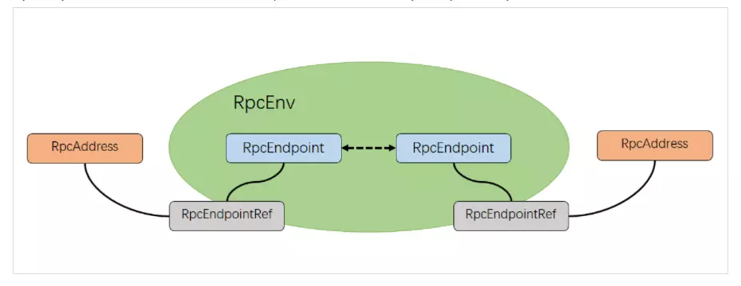
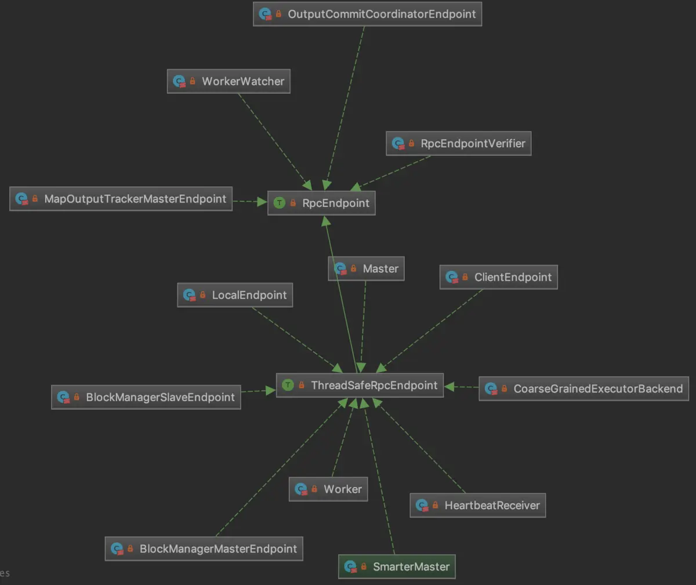

### RpcEnv

RPC环境承担着Spark体系内几乎所有的内部及外部通信，RpcEnv抽象类是Spark RPC环境的通用表示，其中定义的setupEndpoint()方法用来注册一个RPC端点(RpcEndpoint)，
并返回其引用(RpcEndpointRef)。如果客户端想向一个RpcEndpoint发送消息，那么首先必须获取其对应RpcEndpoint的引用。其关系如下所示：

由上图可知RpcEndpoint和RpcEndpointRef是RPC环境中的基础组件，其中RpcEndpoint是一个trait，其定义的方法有：
  * self()：获取当前RpcEndpoint对应的RpcEndpointRef。

  * receive()/receiveAndReply()：接收其它RpcEndpointRef发送的消息并处理，其中receiveAndReply()方法还会发送回复。

  * onError()：消息处理出现异常时调用。

  * onConnected()/onDisconnected()：当前RpcEndpoint建立或断开连接时调用。

  * onNetworkError()：RpcEndpoint的连接出现网络错误时调用。

  * onStart()/onStop()：RpcEndpoint初始化与关闭时调用。

  * stop()：停止当前RpcEndpoint。

其继承体系如下图所示：

上图中可以看到先前出现过的RPC端点，如HeartbeatReceiver、MapOutputTrackerMasterEndpoint、BlockManagerMasterEndpoint等。此外，上图中的
ThreadSafeRpcEndpoint时直接继承自RpcEndpoint的trait，即它要求RPC端点对消息的处理是线程安全的，也就是需要满足happens-before原则。

RpcEndpointRef是一个抽象类，其中有三个属性需要注意，这三个属性都是通过RpcUtils工具类从Spark的配置中获取的。但是，在这三个属性中，前两个属性并
没有引用，这表明它们并没有被用到，下面分别来看一看：
  * maxRetries：最大重连次数，对应配置spark.rpc.numRetries，默认是3次。

  * retryWaitMs：重连前等待时长，对应配置Spark.rpc.retry.wait，默认是3秒。

  * defaultAskTimeout：RPC端点进行ask()操作的默认超时时间，对应配置spark.rpc.askTimeout(优先级更高)和spark.network.timeout，默认值是120秒。

此外，还有两个属性address和name，分别表示RPC端点引用对应的地址和名称。然后，我们来看一下其中的方法：
  * send()：发送一条单向的异步消息，使用"发送即忘"语义，无需回复。

  * askAbortable：异步发送一条消息，并在指定的超时时间内等待RPC端点的回复，RPC端点会调用receiveAndReply()方法来处理，并返回一个
  AbortableRpcFuture，AbortableRpcFuture是对Future的包装并添加了一个abort方法，这个方法在RpcEndpointRef中没有实现。

  * ask()：异步发送一条消息，并在指定的超时时间内等待RPC端点的回复，RPC端点会调用receiveAndReply()方法来处理。

  * askSync()：是ask()方法的同步实现，由于是阻塞发送，可能会花费大量的时间，需要慎用。

NettyRpcEnv是Spark官方提供的RPC环境的唯一实现，通过NettyRpcEnvFactory的create()方法创建，这个方法先创建JavaSerializer序列化器，用于RPC传输
的序列化(前面已经提到过，在大数据处理的过程中，凡是涉及到网络传输，都会在发送端将对象序列化后再在网络上传输，在接收端再反序列化为对象再进行处理)。然
后，通过NettyRpcEnv的构造方法创建NettyRpcEnv，这其中也包含一些RPC基础组件的初始化，最后定义函数变量startNettyRpcEnv并调用工具类Utils中的
startServiceOnPort()方法来启动NettyRpcEnv。其中包含的组件有：
  * TransportConf：传输配置，作用有点类似于RPC环境的SparkConf，负责管理与RPC相关的各种配置。

  * Dispatcher：调度器，用于将消息路由到正确的RPC端点。

  * NettyStreamManager：流式管理器，用于处理RPC环境中的文件，如自定义配置文件或Jar包。

  * TransportContext：传输上下文，作用有点类似于RPC环境中的SparkContext，负责管理RPC的服务端(TransportServer)与客户端(TransportClient)，及
  它们之间的Netty传输通道。

  * TransportClientFactory：创建RPC客户端TransportClient的工厂。

  * TransportServer：RPC环境中的服务端，负责提供基础且高效的流式服务。

TransportConf和TransportContext提供底层的基于Netty的RPC机制，TransportClient和TransportServer则是RPC端点的最低级抽象。