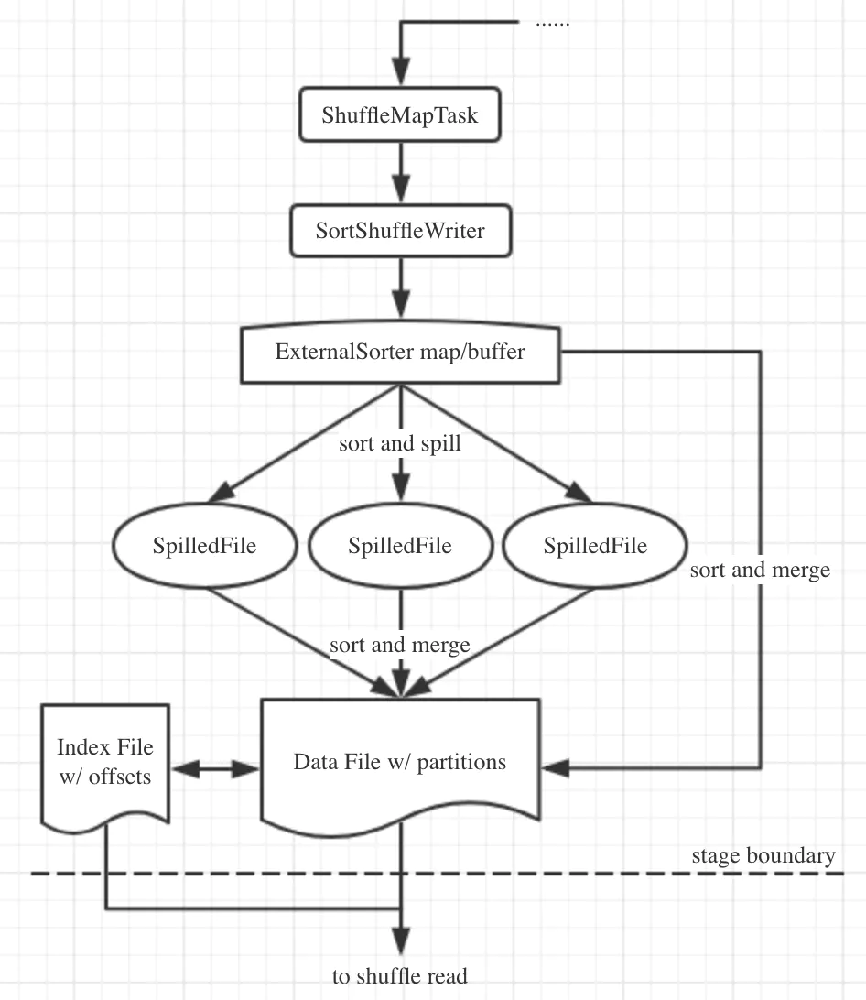

### Shuffle

Shuffle是所有采用mapreduce思想的大数据计算框架的必经阶段，处于map和reduce之间，又可以分为两个子阶段：
  * shuffle write：map任务写上游计算产生的中间数据;

  * shuffle read：reduce任务读取map任务产生的中间数据，用于下游计算;

在Spark 2.0版本以前，Spark有两种Shuffle的方式，分别是sort shuffle和hash shuffle，但在2.0版本以后，hash shuffle机制已经被删除，只保留
了sort shuffle。Shuffle机制的初始化在SparkEnv.create()方法中进行。在其中会通过反射的方式创建ShuffleManager实例，这是个Scala特征，其中
定义了3个核心方法：
  * registerShuffle()：用于注册一种shuffle机制并返回对应的ShuffleHandle，handle中会存储shuffle依赖信息，根据handle可以进一步确定采用
  ShuffleWriter/ShuffleReader的种类;

  * getWriter()：用于获取ShuffleWriter，executor执行map任务时调用;

  * getReader()：用于获取ShuffleReader，executor执行reduce任务时调用;

由于Hash Shuffle被删除，所以SortShuffleManager就是ShuffleManager的唯一实现，来看一下它对上面的三个方法的实现：
  * registerShuffle()：根据条件不同，会返回3种不同的handle，对应3种shuffle机制。检查是否符合SortShuffleWriter.shouldBypassMergeSort()
  方法的条件，如果该shuffle没有map端聚合且分区数不大于参数spark.shuffle.sort.bypassMergeThreshold规定的值(默认200)，则返回BypassMergeSortShuffleHandle，
  启用bypass merge-sort shuffle机制；如果不启用bypass机制，就继续检查是否满足canUseSerializedShuffle()方法的条件，如果使用的序列化器
  支持序列化对象的重定位，且shuffle依赖中完全没有聚合操作，且分区数不大于常量MAX_SHUFFLE_OUTPUT_PARTITIONS_FOR_SERIALIZED_MODE的值(最
  大分区ID号+1，即2^24=16777216)，那么就会返回SerializedShuffleHandle，启用序列化sort shuffle机制(即tungsten-sort)；如果上面两个条件
  均不满足，就返回默认的BaseShuffleHandle，采用基本的sort shuffle机制;

  * getWriter()：根据不同的handle，获取不同的ShuffleWriter。例如，对于tungsten sort会使用UnsafeShuffleWriter，bypass会使用BypassMergeSortShuffleWriter，
  普通的sort则使用SortShuffleWriter，这些Writer都继承自ShuffleWriter抽象类，且都实现了write()方法;

  * getReader()：这个就比较简单了，只有一种即BlockStoreShuffleReader，它继承自ShuffleReader特征，并实现了read()方法;

先来张图总结一下：

再来看看它的write()方法，代码并不难，逻辑就是根据Shuffle是否有map端预聚合来传递不同的参数构建外部排序器ExternalSorter，然后将shuffle的数据
放入进行处理，然后创建输出索引文件和输出文件，返回MapStatus数据结构。再来跟一下ExternalSorter类，在它的insertAll()方法中，会根据是否需要进行
map端预聚合来进行不同的处理。如果需要进行map端预聚合，则使用PartitionedAppendOnlyMap保存聚合数据，这是一个能够保存分区信息的，且只能追加的映射
型结构，其键类型是(partition_id, key)二元组。如果不需要map端预聚合，则将数据放入PartitionedPairBuffer中，其作用与PartitionedAppendOnlyMap
类似，只不过内部不是映射型结构而是可变长度的数组。这些操作都是在内存中进行，当内存不足时会溢写磁盘操作，调用的方法是maybeSpillCollection()，这个
方法是对maybeSpill()方法的简单封装，它会调用maybeSpill()方法检查是否需要溢写磁盘，在这个方法中会先申请内存扩容，如果申请不到内存或申请到的内存过
少才开始溢写，也就是说它会尽量的使用内存进行sort shuffle，直到实在没有足够的内存才会使用磁盘(毕竟磁盘操作相比内存操作慢了几个数量级)。这里有个很有
意思的事情：传入的参数currentMemory的含义是缓存的预估内存占用量而不是实际占用量，这是因为上面介绍的PartitionedAppendOnlyMap和PartitionedPairBuffer
都能进行动态扩容，并且都能通过采样估计其大小。

真正负责溢写磁盘的方法是spill()方法，它根据TimSort算法进行排序，这个算法是很多平台排序算法的默认实现，它原则上使用的是归并排序算法，但是在小片段合并
中使用了插入排序算法。在得到排序结果后将这些数据通过spillMemoryIteratorToDisk()方法写入磁盘文件，实现上是遍历上面生成的map或buffer缓存中的数据，逐
条写入到diskWriter中，并在记录条数达到批次阈值(默认是10000)将这批数据刷到磁盘中，最后返回溢写的文件对象，这个过程是能保证顺序的。另外，一旦发生溢写就
会重新new出上面的map或buffer结构重新开始缓存。

既然是sort shuffle，那么在输出时肯定也是排序的，它会根据是否有溢写文件进行不同的处理。如果没有溢写，那么就会非常简单，直接按照是否有map端预聚合从map
或buffer中取出数据并排序即可。如果有溢写，则还需要将溢写文件与缓存的数据按照分区进行归并排序。但是不管是否有溢写，得到的排序结果都会被合并到一个文件中。
由于排序时是先按分区ID排序，再根据是否有排序规则判断是否按key排序。所以这个排序并不能保证数据有序。

那么数据文件和索引文件是如何输出的呢？从IndexShuffleBlockResolver类的writeIndexFileAndCommit()方法可知，它使用BufferedOutputStream进行批量写
入，且每一个ShuffleMapTask通过SortShuffleWriter会产生两个文件，一个分区的数据文件，一个索引文件。

最后，用一张图来总结一下：

