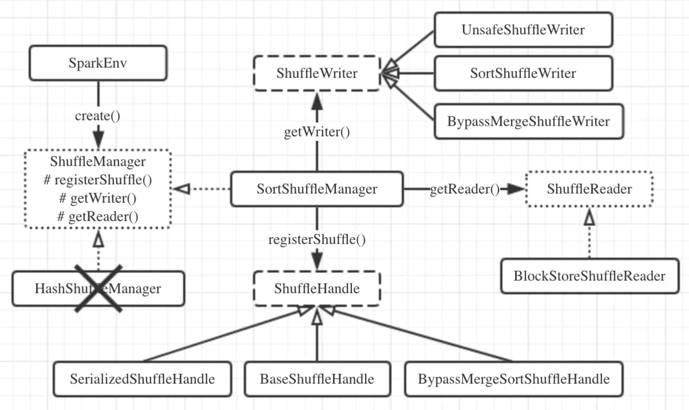

### Shuffle

Shuffle是所有采用mapreduce思想的大数据计算框架的必经阶段，处于map和reduce之间，又可以分为两个子阶段：
  * shuffle write：map任务写上游计算产生的中间数据;

  * shuffle read：reduce任务读取map任务产生的中间数据，用于下游计算;

在Spark 2.0版本以前，Spark有两种Shuffle的方式，分别是sort shuffle和hash shuffle，但在2.0版本以后，hash shuffle机制已经被删除，只保留
了sort shuffle。Shuffle机制的初始化在SparkEnv.create()方法中进行。在其中会通过反射的方式创建ShuffleManager实例，这是个Scala特征，其中
定义了3个核心方法：
  * registerShuffle()：用于注册一种shuffle机制并返回对应的ShuffleHandle，handle中会存储shuffle依赖信息，根据handle可以进一步确定采用
  ShuffleWriter/ShuffleReader的种类;

  * getWriter()：用于获取ShuffleWriter，executor执行map任务时调用;

  * getReader()：用于获取ShuffleReader，executor执行reduce任务时调用;

由于Hash Shuffle被删除，所以SortShuffleManager就是ShuffleManager的唯一实现，来看一下它对上面的三个方法的实现：
  * registerShuffle()：根据条件不同，会返回3种不同的handle，对应3种shuffle机制。检查是否符合SortShuffleWriter.shouldBypassMergeSort()
  方法的条件，如果该shuffle没有map端聚合且分区数不大于参数spark.shuffle.sort.bypassMergeThreshold规定的值(默认200)，则返回BypassMergeSortShuffleHandle，
  启用bypass merge-sort shuffle机制；如果不启用bypass机制，就继续检查是否满足canUseSerializedShuffle()方法的条件，如果使用的序列化器
  支持序列化对象的重定位，且shuffle依赖中完全没有聚合操作，且分区数不大于常量MAX_SHUFFLE_OUTPUT_PARTITIONS_FOR_SERIALIZED_MODE的值(最
  大分区ID号+1，即2^24=16777216)，那么就会返回SerializedShuffleHandle，启用序列化sort shuffle机制(即tungsten-sort)；如果上面两个条件
  均不满足，就返回默认的BaseShuffleHandle，采用基本的sort shuffle机制;

  * getWriter()：根据不同的handle，获取不同的ShuffleWriter。例如，对于tungsten sort会使用UnsafeShuffleWriter，bypass会使用BypassMergeSortShuffleWriter，
  普通的sort则使用SortShuffleWriter，这些Writer都继承自ShuffleWriter抽象类，且都实现了write()方法;

  * getReader()：这个就比较简单了，只有一种即BlockStoreShuffleReader，它继承自ShuffleReader特征，并实现了read()方法;

来张图总结一下：
