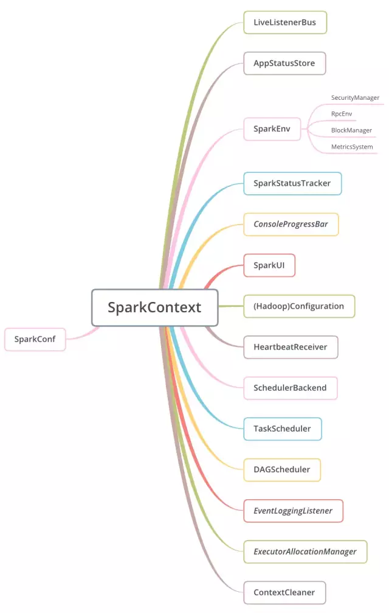

### SparkContext构建

对Spark有所了解的同学都知道，SparkContext绝对是Spark编程非常重要且经常接触的一个东西，可以说是核心中的核心。它存在于Driver中，是开发Spark应用的入口，
负责和整个集群的交互，包括申请集群资源、创建RDD、创建累加器和广播变量等。理解Spark的架构就必须从这个入口开始。下图是官网的一张Spark架构图：

对于该图官网有几点说明：

  (1) 不同的Spark应用程序对应着不同的Executor，这些Executor在整个应用程序执行期间都存在，并且可以以多线程的方式执行Task，Task是集群上
运行的基本单位。(Hmmmm....回忆一下，Storm中也有Executor，但Storm中的Executor是一个单独的线程，默认里面有一个Task，如果设置多个，同一个
Executor中的Task必须是同类型的，要么是Spout，要么是bolt，并且多个Task以串行方式执行，因此Storm中运行的基本单位其实是Executor。Flink中
呢，没有Executor，与之对应的个人觉得应该是Slot，Slot中以多线程的方式运行Task，每个Task是一个线程，因此Flink中运行的基本单位也是Task。)
Spark这样做的好处是，各个Spark应用程序的执行是相互隔离的，除了Spark应用程序向外部存储系统写数据进行数据交互外，无法进行其他形式的数据共享。

  (2) Spark对于其使用的集群资源管理器没有感知能力，只要它能申请Executor并与之通信即可。这样设计的好处是，无论使用哪种资源管理器，执行流程都是
确定的，它不受资源管理器的限制，可以随意替换其资源管理器，于是可以很方便的替换为YARN或Mesos之类的资源管理器。

  (3) Spark应用程序在整个执行过程中都要与Executors进行来回通信。

  (5) Driver端负责Spark应用程序任务的调度，所以Driver应尽量靠近Worker节点。

  另外，图中DriverProgram就是用户提交的程序，里面就定义有SparkContext的的实例。SparkContext默认的构造函数接受的是org.apache.spark.SparkConf，
通过这个参数我们可以自定义提交的参数，这个参数会覆盖系统提供的默认配置。

SparkContext初始化了很多的组件，并且使用其预先定义的私有变量字段维护了其需要初始化的组件的内部状态。下图是SparkContext负责初始化的组件一览：

下面对这些组件做一些简要的介绍：
  * SparkConf，这个在[Spark源码阅读1：SparkConf](../master/docs/sparkconf.md)中已经介绍过，它是构造SparkContext时传进来的参数。SparkContext
  会先将传进来的SparkConf克隆一份(此时就理解了为何SparkConf需要继承了Cloneable这个trait)，然后在克隆出的副本上进行校验(主要是应用名和Master的校验)，
  并且添加一些其它的必要的参数(Driver的地址、应用ID等)。克隆出来的SparkConf使得用户不可以再更改配置项，保证了Spark配置在运行时的不可变性。
  * LiveListenerBus，是SparkContext中的事件总线，它异步的将监听器事件(SparkListenerEvents)传递给已经注册的监听器(SparkListeners)，这是一种
  监听器设计模式，Spark中大量的应用了这种设计模式以适应集群环境下的分布式事件汇报。除了LiveListenerBus外，Spark中还有其它多种事件总线，它们都继承自
  ListenerBus特征(trait)，事件总线是Spark底层重要的支撑组件。
  * AppStatusStore，看名字就知道是一个存储支撑组件，它提供Spark程序运行过程中各项指标的键值对存储，UI上看到的数据指标基本上都存储在这里，底层使用的是
  ElementTrackingStore，这是一种能够跟踪特定类型的元素的数量并且一旦达到阈值就触发事件的的键值对存储结构，比较适用于监控场景。此外，还会产生一个监听器
  AppStatusListener实例，并注册到上面的LiveListenerBus中去用来收集监控数据。
  * SparkEnv，是Spark的执行环境，Driver和Executor都需要SparkEnv提供的各类组件形成的执行环境作为基础，其初始化依赖于LiveListenerBus，且在
  SparkContext的初始化时只创建了Driver的执行环境，Executor的执行环境将会在后面创建。在创建完成Driver的执行环境后，会使用SparkEnv伴生对象中的set()
  方法保存它，做到"create once，use anywhere"。通过SparkEnv管理的组件很多，包括安全管理器SecurityManager、RPC环境RpcEnv、存储块管理器
  BlockManager、监控指标系统MetricsSystem。在SparkContext构造方法中，使用了SparkEnv初始化BlockManager和启动MetricsSystem。

Spark中有几个非常重要的成员：TaskScheduler、HeartbeatReceiver、DAGScheduler。通过createTaskScheduler方法，可以获得不同资源管理类型或
部署类型的调度器，现阶段支持：local本地单线程、local[k]本地k个线程、local[*]本地cpu核数个线程、spark支持Spark Standalone、yarn支持连接Yarn。

  对于Standalone模式来说，scheduler的实现是TaskSchedulerImpl，它通过一个SchedulerBackend管理所有Cluster的调度，实现了通用的逻辑。系统刚启动时，
有两个函数需要注意：initialize()和start()，它们也是在SparkContext初始化时调用的。initialize()方法主要是完成了SchedulerBackend的初始化，
通过集群的配置来获取调度模式，目前支持两种调度模式：FIFO和公平调度，默认是FIFO调度模式。start()方法主要是backend的启动。对于非本地模式且设置了
spark.speculation为true的情况，指定时间未返回的task会启动另外的task去执行。对于一般应用，这在可能减少任务的执行时间的同时，也造成了集群计算资源的
浪费。因此对于时效性要求不高的离线应用来说，不推荐这样的设置。Standalone模式的SchedulerBackend是SparkDeploySchedulerBackend。

资源调度SchedulerBackend类及相关子类如下图：

