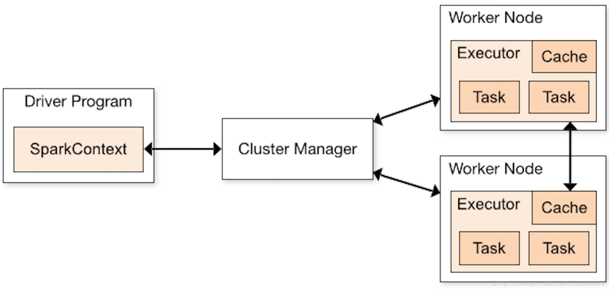
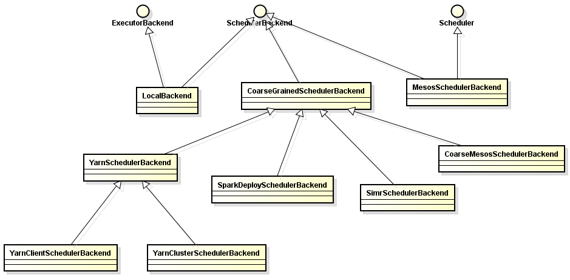

### SparkContext构建

对Spark有所了解的同学都知道，SparkContext绝对是Spark编程非常重要且经常接触的一个东西。它是开发Spark应用的入口，负责和整个集群的交互，包括
申请集群资源、创建RDD、累加器和广播变量等。理解Spark的架构就必须从这个入口开始。下图是官网的一张Spark架构图：

对于该图官网有几点说明：

  (1) 不同的Spark应用程序对应着不同的Executor，这些Executor在整个应用程序执行期间都存在，并且可以以多线程的方式执行Task。(Hmmmm....回忆
一下，Storm中也有Executor，但Storm中的Executor是一个单独的线程，默认里面有一个Task，如果设置多个，同一个Executor中的Task必须是同类型的，
要么是Spout，要么是bolt，并且多个Task以串形方式执行。Flink中呢没有Executor，与之对应的个人觉得应该是Slot，Slot中以多线程的方式运行Task，
每个Task是一个线程。)Spark这样左的好处是，各个Spark应用程序的执行是相互隔离的，除了Spark应用程序向外部存储系统写数据进行数据交互外，无法进行
其他形式的数据共享。

  (2) Spark对于其使用的集群资源管理器没有感知能力，只要它能申请Executor并与之通信即可。这样设计的好处是，无论使用哪种资源管理器，执行流程都是
确定的，它不受资源管理器的限制，可以随意替换其资源管理器。

  (3) Spark应用程序在整个执行过程中都要与Executors进行来回通信。

  (5) Driver端负责Spark应用程序任务的调度，所以Driver应尽量靠近Worker节点。

  另外，图中DriverProgram就是用户提交的程序，里面就定义有SparkContext的的实例。SparkContext默认的构造函数接受的是org.apache.spark.SparkConf，
通过这个参数我们可以自定义提交的参数，这个参数会覆盖系统提供的默认配置。

Spark中有几个非常重要的成员：TaskScheduler、HeartbeatReceiver、DAGScheduler。通过createTaskScheduler方法，可以获得不同资源管理类型或
部署类型的调度器，现阶段支持：local本地单线程、local[k]本地k个线程、local[*]本地cpu核数个线程、spark支持Spark Standalone、yarn支持连接Yarn。

  对于Standalone模式来说，scheduler的实现是TaskSchedulerImpl，它通过一个SchedulerBackend管理所有Cluster的调度，实现了通用的逻辑。系统刚启动时，
有两个函数需要注意：initialize()和start()，它们也是在SparkContext初始化时调用的。initialize()方法主要是完成了SchedulerBackend的初始化，
通过集群的配置来获取调度模式，目前支持两种调度模式：FIFO和公平调度，默认是FIFO调度模式。start()方法主要是backend的启动。对于非本地模式且设置了
spark.speculation为true的情况，指定时间未返回的task会启动另外的task去执行。对于一般应用，这在可能减少任务的执行时间的同时，也造成了集群计算资源的
浪费。因此对于时效性要求不高的离线应用来说，不推荐这样的设置。Standalone模式的SchedulerBackend是SparkDeploySchedulerBackend。

资源调度SchedulerBackend类及相关子类如下图：

