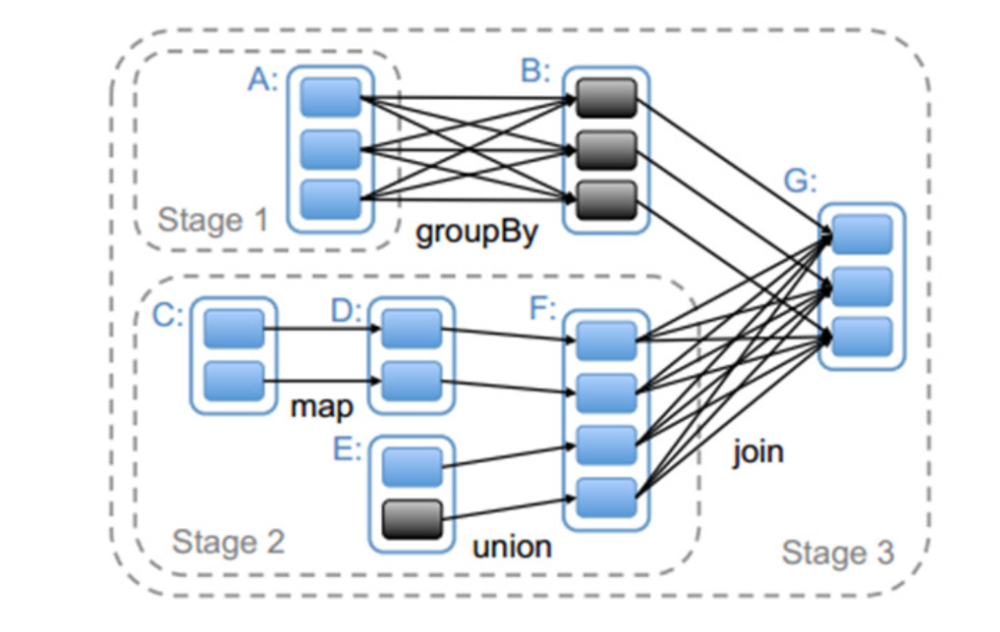

### Stage的划分

在[Spark源码阅读30：Spark任务提交](./jobsubmit.md)中已经讲过了Spark Job的提交，在其中提到，当rdd触发action操作后，都会
调用SparkContext的runJob方法，并调用DAGScheduler.handleJobSubmitted方法完成整个job的提交。DAGScheduler会根据RDD的lineage进行Stage
的划分，生成TaskSet，并由TaskScheduler向集群申请资源，最终在Worker节点的Executor进程中执行Task。

先看一下如何进行Stage的划分，如下图所示是对应Spark应用程序代码生成的Stage。它根据RDD的依赖关系进行划分，在遇到宽窄依赖时将两个RDD划分为不同
的Stage(什么是宽依赖，什么是窄依赖，可以看[Spark源码阅读26：RDD](./rdd.md)进行了解)。

在上图中可以看到，RDD G与RDD F间的依赖是宽依赖，所以RDD F与RDD G被划分为不同的Stage，而RDD B与RDD G之间是窄依赖，因此RDD B与RDD G被
划分为同一个Stage。通过这种递归的调用方式，将所有的RDD进行划分。实际上[Spark源码阅读30：Spark任务提交](./jobsubmit.md)里也已经大致介绍过，
最后一个Stage也就是finalStage的创建是通过触发action来实现的。在递归生成Stage时具体区分宽依赖与窄依赖的办法是看依赖关系是否为ShuffleDependency，
如果是则表示是宽依赖，需要重新生成Stage，否则就可以属于同一个Stage，生成完成finalStage后就会进行Stage的提交。