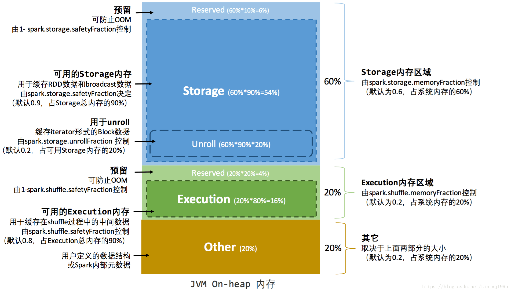

### StaticMemoryManager

在[Spark源码阅读21：MemoryManage](./memorymanage.md)的最后已经看过MemoryManager类，点开其的实现会发现，它有两个实现类：StaticMemoryManager和
UnifiedMemoryManager(TestMemoryManager属于测试类，不算)，前者是在Spark 1.6版本之前使用，之后默认采用的是后者。虽然前者已经默认不再使用，但是由于
它相对比较简单，对于研究源码来说还是可以读一下的。

MemoryManager类是在SparkEnv.create()方法中初始化的，在其中会首先检查spark.memory.useLegacyMode配置项，如果为true则使用StaticMemoryManager，
否则使用UnifiedMemoryManager，默认是false。在这里初始化StaticMemoryManager类时调用的是只有两个参数的辅助构造方法，另外两个参数maxOnHeapExecutionMemory
和maxOnHeapStorageMemory是通过StaticMemoryManager.getMaxExecutionMemory()和StaticMemoryManager.getMaxStorageMemory()这两个方法来计算
出来的。

MaxExecutionMemory的计算规则是，spark.testing.memory配置项的值(如无，则是Java虚拟机所能使用的内存最大值，但由于spark.testing.memory配置项基本
不配置，所以一般都是这个值) * spark.shuffle.memoryFraction配置项的值(默认是0.2) * spark.shuffle.safetyFraction配置项的值(默认是0.9)，得到的
值取Long型结果也就是取整。值得注意的是：在上面的计算过程中会对Driver和Executor的内存大小进行校验，它们必须大于32M，否则会抛出IllegalArgumentException
异常。

MaxStorageMemory的计算规则是，其值是spark.testing.memory配置项的值(如无则是Java虚拟机所能使用的内存最大值，但由于spark.testing.memory配置项
基本不配置，所以一般都是这个值) * spark.storage.memoryFraction配置项的值(默认是0.6) * spark.storage.safetyFraction配置项的值(默认是0.9)。

初始化代码中还有两行，上面的注释写得很清楚由于StaticMemoryManager不支持堆外存储内存，所以将堆外存储内存转交给了堆外执行内存池。

UnrollMemory在前面已经提到，maxUnrollMemory的取值是上面的maxOnHeapStorageMemory的值 * spark.storage.unrollFraction配置项的值(默认是0.2)。

在计算MaxExecutionMemory和MaxStorageMemory的取值时会发现总的内存(1) - spark.shuffle.memoryFraction(0.2) - spark.storage.memoryFraction(0.6)
后还剩余一定的内存(默认是0.2)，这部分内存主要给用户代码使用的。另外，在上面的每一个值的最终结果的计算中还乘以了safetyFraction，这是为了留出一些额外的内存
空间备用以免出现OOM。

StaticMemoryManager类实现了MemoryManager中定义的三个用于申请内存的方法：acquireStorageMemory()、acquireUnrollMemory()和acquireExecutionMemory()
方法，实现上都是调用各个MemoryPool的acquireMemory()方法来实现，并且由于StaticMemoryManager不支持堆外存储内存，所以StorageMemory和UnrollMemory
只在堆内申请，而ExecutionMemory则可以根据memoryMode的取值的不同在堆内或堆外申请。另外，在acquireUnrollMemory()方法中，由于unrolling时可能需要释放
缓存块来获得额外的空间，因此必须规定一个释放空间的上限(也就是maxUnrollMemory - currentUnrollMemory - freeMemory)，否则有可能展开一个超大的块导致所有
的缓存都被清除。

从代码上分析了这么多，文字上描述太过抽象，把我自己都给整迷糊了，来张图总结下，可能会比较清晰：

