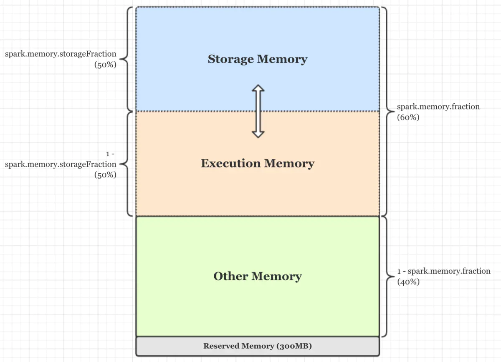
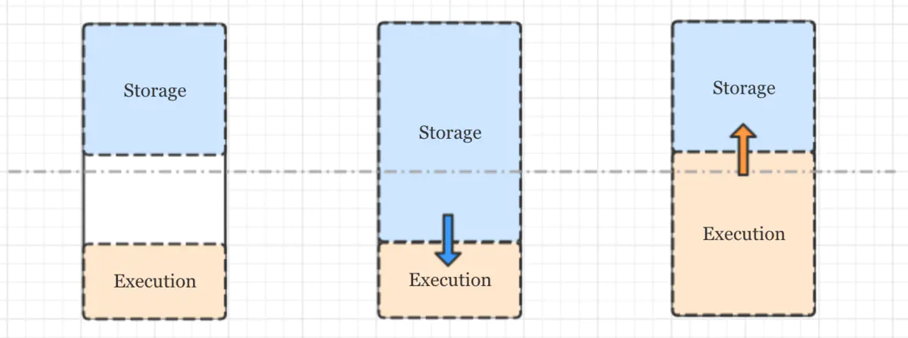

### UnifiedMemoryManager

在[Spark源码阅读22：StaticMemoryManager](./staticmemorymanager.md)中分析了静态内存管理器StaticMemoryManager，也在最后总结了一些它的缺陷，既然存在缺陷
并且缺陷很明显(最主要的是，都已经把它的缺陷坦白讲了)，那么就一定有一个新的内存管理器能够弥补它的这些缺陷，这就是今天要分析的统一内存管理器UnifiedMemoryManager，
它也是自Spark 1.6开始默认的内存管理器。

UnifiedMemoryManager相比于StaticMemoryManager最主要的改进有两点：
  * 各内存区域的大小不是事先通过各种比例参数确定好的，而是在满足一定的条件下可以互相借用，使得内存区域的分配更加灵活;

  * 支持堆外存储内存;

还是从SparkEnv.create()方法中看起，当初始化UnifiedMemoryManager类的实现时，与初始化StaticMemoryManager类的实现类似，调用的构造方法还是只有两个参数，但是会
通过其伴生对象的apply()方法(要区分是直接调用了类的构造函数，还是通过apply()方法调用很简单，如果前面有new就是前者，没有就是后者)来真正调用其主构造方法，在apply()
方法中，通过getMaxMemory()方法计算出maxMemory的值，计算逻辑是：
  * spark.testing.memory配置项的值作为系统内存大小，如果该配置项为空则取得JVM虚拟机的最大可用内存(一般该配置项都为空);

  * spark.testing.reservedMemory配置项的值作为保留内存大小，如果配置项为空，则判断配置中是否包含spark.testing的配置项，如果包含则保留内存为0，否则为RESERVED_SYSTEM_MEMORY_BYTES
  也就是300M，由于一般spark.testing.reservedMemory配置项都为空，所以保留内存大小一般都是300MB;

  * 如果Driver或Executor的内存小于保留内存的1.5倍也就是450MB，则抛出IllegalArgumentException异常;

  * 系统内存大小减去保留内存大小作为可用内存，spark.memory.fraction配置项指定实际的可用内存比例，默认是0.6，所以最终的可用内存是前面得到的可用内存再乘以
  spark.memory.fraction配置项的乘积;

getMaxMemory()方法计算得到的是最大的堆内存，堆内存储内存空间的大小由最大的堆内存乘以spark.memory.storageFraction配置项得到，默认该配置项的大小是0.5，剩下的
就是堆内执行内存，也就是说默认存储内存和执行内存各占一半。在计算出这些值后调用主构造函数初始化UnifiedMemoryManager类的实例，初始化时还会分别校验堆内和堆外的存储以及执行内存
之和是否与规定的最大堆内和堆外内存相等。

从上面的分析来看，由于堆内存储与执行内存的比例是浮动的，所以就没有了StaticMemoryManager中的unrollFraction和safetyFraction这些比例，看上去要更简单。下面用一张
图来总结UnifiedMemoryManager的内存分配，图中存储内存和执行内存的边界不固定可浮动：

再来看看UnifiedMemoryManager类对MemoryManager类中的三个申请内存的方法：acquireStorageMemory()、acquireUnrollMemory()和acquireExecutionMemory()的实现。
先来分析acquireStorageMemory()方法：首先根据memoryMode的取值来决定是在堆内还是堆外申请存储内存，如果申请的内存量大于相应区域存储内存的最大可用内存量则返回false表示
申请失败，否则判断申请的内存量是否大于相应区域存储内存的最大空闲量，如果不大于则直接调用storagePool.acquireMemory()方法申请内存，否则表示相应区域存储内存的空闲量
不足，需要尝试向相应区域的执行内存借用内存，借用的最大值是执行内存的空闲量与不足的量的值两者中的最小值(很好理解，如果执行内存的空闲量比要借的量小，肯定只能借执行内存
所能出借的最大值)，然后减小相应区域执行内存池的大小，并增大相应区域的存储内存池的大小，也就是浮动两者的比例。

再来分析acquireUnrollMemory()方法：很简单，居然是直接调用了acquireStorageMemory()方法，因为再统一内存管理器中，UnrollMemory与StorageMemory之间没有边界(从
上面的图中也可以看出来)，所以两者的申请方式完全一致。

最后来看下acquireExecutionMemory()方法：首先也是根据memoryMode的取值来决定是在堆内还是堆外申请执行内存，只不过多拿到了一个对应区域存储内存的大小，最重要的方法
是其内部定义的方法maybeGrowExecutionPool()方法，其执行逻辑是：
  * 计算从存储内存池中可回收多少内存，可回收的内存大小是相应区域存储内存的空闲大小与存储内存从执行内存中借走的内存大小两者中的最大值;

  * 如果执行内存中可回收的内存大小大于0，则执行storagePool.freeSpaceToShrinkPool()方法来释放空间以减小存储内存池的大小(实际上只释放了空间，减小的事还是得调用方
  来做)，释放的大小是存储内存池可回收内存大小与实际额外需要的内存大小两者之间的最小值，也就是只回收了需要且可以回收的大小;

  * 调用storagePool.decrementPoolSize()减小存储内存池的大小，调用executionPool.incrementPoolSize()增大执行内存池的大小;

从上面的逻辑来看，如果存储内存不够用，它只能借用执行内存空闲的内存。而当执行内存不够用时，它不仅能借用存储内存空闲的内存，还能够要求存储内存释放空间以归还之前它借用的
执行内存。为什么存储内存不能要求执行内存也归还之前它借用的存储内存呢？因为存储内存的数据可以直接持久化到磁盘，而执行内存中的数据基本都是中间数据，如果这些数据被清除，
可能会导致整个Task失败。下图描述了内存借用的流程：

在acquireExecutionMemory()方法中还有另一个内部定义的方法computeMaxExecutionPoolSize()，它用于计算在驱逐了存储内存后执行内存可能达到的大小。这个方法和上面的
maybeGrowExecutionPool()方法都会被作为executionPool.acquireMemory()方法的参数传入，因此再来看一下acquireMemory()方法：它会首先将taskAttemptId放入taskMemory
映射中，然后循环的申请内存。每次循环都会调用maybeGrowPool()方法(就是上面分析过的maybeGrowExecutionPool()方法，只不过换了个别名)来尝试从存储内存池中回收内存，
如果分配到的内存比实际申请的要少，并且该Task当前的内存加上新分配到的内存小于每个Task应该获得的内存大小的最小值(也就是池子大小除以活跃Task数量的两倍)，则调用lock.wait()
方法阻塞，直到有其它Task释放内存，并继续循环，循环的结束条件是申请到了足够的内存或者我们确定不再进行这次分配。

统一内存管理器虽然解决了静态内存管理器的诸多不足，但是也不是使用它就万事大吉了，也还是存在着许多情况需要进行针对性的内存调优，其实Spark应用程序OOM是时常会出现的问题，
如何对作业的内存进行问题定位和执行调优非常重要，是一个需要持续进行学习和实践的方向。